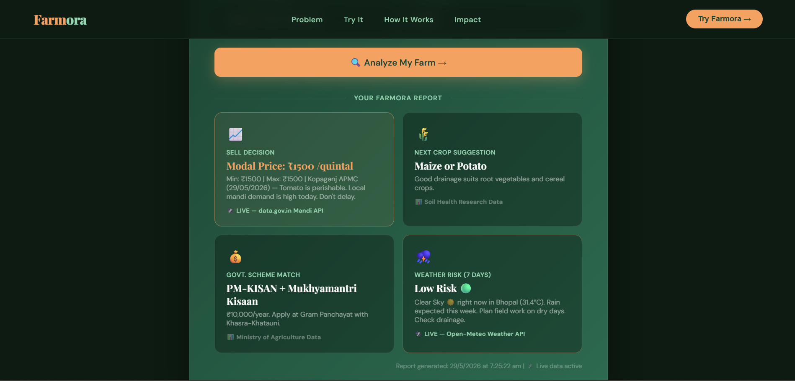
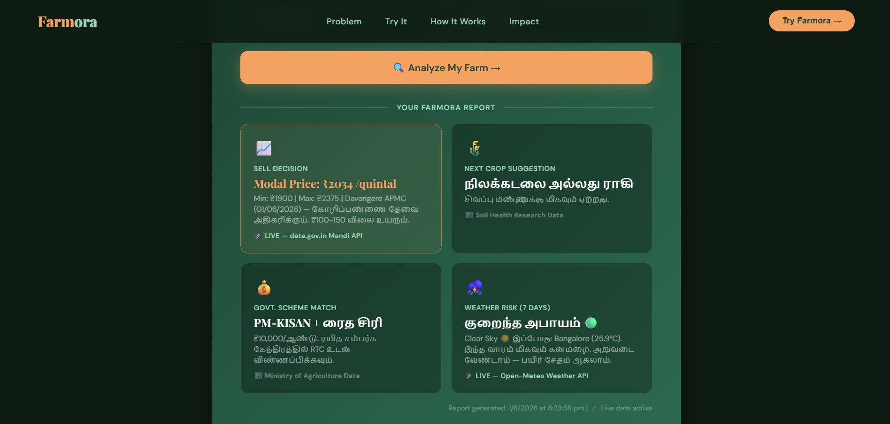

<div align="center">

# 🌾 FARMORA
### India's First AI-Powered Farmer Decision Engine

[](https://hemaa-varsh.github.io/farmora)
[](https://github.com/Hemaa-varsh/farmora)

</div>

---

## 🎯 About FARMORA

**FARMORA** is an AI-powered web application built for **rural Indian farmers** who lack access to real-time agricultural data and expert guidance.

It combines **live weather data**, **government mandi prices**, **soil health research**, and **government scheme matching** — all in one place — to help farmers make smarter decisions every day.

> 💡 Built as a Hackathon Project for **SkilStation National Summer Hackathon 2026**

---

## ✨ Features

| Feature | Description |
|--------|-------------|
| 🌤️ **Weather Risk Analysis** | 7-day forecast powered by Open-Meteo API |
| 💰 **Sell Decision Engine** | Live mandi prices from data.gov.in API |
| 🌱 **Next Crop Suggestion** | Smart crop recommendation based on soil data |
| 🏛️ **Govt. Scheme Matcher** | Matches farmers to PM-KISAN & state schemes |
| 🗣️ **6-Language Support** | Hindi, Tamil, Telugu, Kannada, Bengali, English |
| 📊 **FARMORA Report** | One-click AI farm analysis report |

---

## 🛠️ Tech Stack

* **Frontend:** HTML, CSS, JavaScript
* **Data:** Ministry of Agriculture Soil Health Research, Open-Meteo Weather
* **Languages:** English, Hindi, Tamil, Telugu, Kannada, Bengali
* **Deployment:** GitHub Pages
* **Architecture:** Serverless, no backend required
---

## 📸 Screenshots

### 🌐 English Version


### 🗣️ Tamil Version — தமிழ் இல்

---

## 📁 Folder Structure

```
farmora/
│
├── 📄 index.html          → Main HTML file
├── 📁 css/
│   └── 🎨 style.css       → Stylesheet
├── 📁 js/
│   └── ⚙️ app.js          → Main JavaScript logic
├── 📁 screenshots/
│   ├── 🖼️ dashboard.png   → English screenshot
│   └── 🖼️ dashboard-tamil.png → Tamil screenshot
└── 📄 README.md           → Project documentation
```
---

## 🚀 How to Use

1. Visit the **[Live Demo](https://hemaa-varsh.github.io/farmora)**
2. Enter your **location and crop details**
3. Click **"Analyze My Farm →"**
4. Get your **personalized FARMORA Report!**

---

## 🔮 Future Improvements

- [ ] 📱 Mobile App (Android/iOS)
- [ ] 🤖 AI Chatbot for farmer queries
- [ ] 📡 IoT sensor integration
- [ ] 🗺️ District-level crop mapping
- [ ] 💬 WhatsApp Bot integration

---


## 👩‍💻 Developer

**HEMAVARSHINI M**
* ECE Student | RMD Engineering College


* **Email:** [hemavarsh14@gmail.com](mailto:hemavarsh14@gmail.com)
* **LinkedIn:** [hemavarshini04](https://www.linkedin.com/in/hemavarshini04)
* **GitHub:** [Hemaa-varsh](https://github.com/Hemaa-varsh)

---

<div align="center">
Made with ❤️ for Indian Farmers 🌾
</div>
